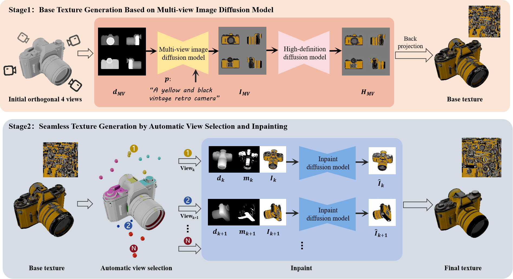

# WonderTex
Consistent-and-Seamless Texture Generation with Text-Guided Multi-View Image Diffusion Models

<p align="center"></p>

## Abstract 📖
>Text-guided texture generation has been rapidly developed with the proliferation of generative artificial intelligence for creating three-dimensional textured objects. However, existing text-guided texture generation methods often suffer from artifacts such as inconsistent visual appearance across different views, Janus problems and seams in texture maps. To address these issues, a novel text-guided texture generation method, named *WonderTex*, is proposed. It aims to produce high-quality, view-consistent, and seamless texture maps by overcoming the shortcomings of existing texture generation methods. Specifically, we fine-tune a Stable Diffusion model using a large dataset to obtain a multi-view image diffusion model capable of generating a 4-view grid. This model serves as the foundation for producing four consistent views and establishing the base texture through back-projection. Subsequently, an automatic view selection and inpainting strategy is employed to effectively fill and refine the texture maps. Extensive experiments have shown that our method is effective and robust, capable of generating high-qaulity textures with various meshes and prompts, outperforming baseline methods in terms of texture details, view consistency, and other metrics.

## Setup 📍
The code is tested on Ubuntu 20.04 LTS with PyTorch  2.0.0 Cuda  11.8 installed. To run our method, you should at least have a NVIDIA GPU with 12 GB RAM (NVIDIA GeForce 4090 Ti works for us).

To install, first clone the repository and install PyTorch.
```bash
# git clone the respository
git clone https://github.com/A-pril/WonderTex.git
cd WonderTex

# create and activate the conda environment
conda create -n wondertex python=3.8.0
conda activate wondertex

# install PyTorch 2.0.0
conda install pytorch==2.0.0 torchvision==0.15.0 torchaudio==2.0.0 pytorch-cuda=11.8 -c pytorch -c nvidia
```

Then install PyTorch3D through the following URL (change the respective Python, CUDA and PyTorch version in the link for the binary compatible with your setup), or install according to official [installation guide](https://github.com/facebookresearch/pytorch3d/blob/main/INSTALL.md)
```bash
pip install https://dl.fbaipublicfiles.com/pytorch3d/packaging/wheels/py38_cu118_pyt200/download.html
```

## Inference 🚀
```bash
python run_experiment.py --config {your config}.yaml
```
Refer to [parse.py](src/parse.py) for the list of arguments and settings you can adjust. You can change these settings by including them in a `.yaml` config file like the [config.yaml](src/config/config.yaml) or passing the related arguments in command line; values specified in command line will overwrite those in config files.

Here is an example of lucky-cat with a text prompt.
```bash
python run_texture.py --config ./config/config.yaml
```

Here is another example of next-gen [NASCAR](shapes/nascar.obj) from [ModelNet40](https://modelnet.cs.princeton.edu/) with a text prompt.

```bash
python run_texture.py --config ./config/nascar.yaml
```


## News 🚩
- 2024.12 Upload paper and release project.

## Acknowledgement 💌
We have partly borrow codes from the following repositories. Many thanks to the authors for sharing their codes.
- [stable diffusion finetune](https://github.com/huggingface/diffusers/tree/main/examples/text_to_image)
- [Stable Diffusion](https://github.com/CompVis/stable-diffusion)
- [ControlNet](https://github.com/lllyasviel/ControlNet)
- [SyncMVD](https://github.com/LIU-Yuxin/SyncMVD)
- [Wonder3D](https://github.com/xxlong0/Wonder3D)


## Citation 🐰
If you find this repository useful in your project, please cite our work.
```
@article{Xu2024WonderTex,
  title={WonderTex: Consistent-and-Seamless Texture Generation with Text-Guided Multi-View Image Diffusion Models},
  author={Xu, Qi and Zhang, Lei and Han, Xiaoguang},
  journal={arXiv preprint arXiv:2310.15008},
  year={2024}
}
```